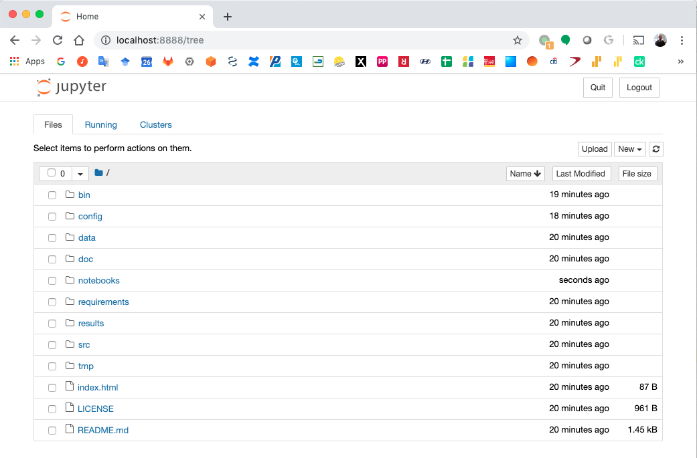
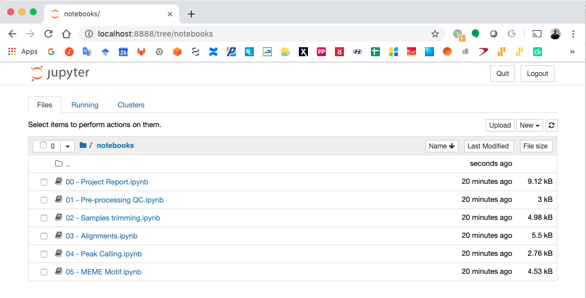

Detection of binding events from ChIP-exo data
==============================================

.. warning::  Read the :doc:`Background Information </background_information>` before proceeding with these steps

.. warning::
   Read the :doc:`Project Templates Installation <installation>` notes to have the **cookiecutter** available
   in you shell depending on the execution environment you will be using.

Sample description file: factors.txt
------------------------------------

A samples description file named: **factors.txt** must be created with all samples file name and metadata. The format
of this file is described :doc:`here <factors_file>`.

ChIP-exo workflow with Conda/Bioconda
-------------------------------------

ChIP-exo workflow project structure with Conda/Bioconda
^^^^^^^^^^^^^^^^^^^^^^^^^^^^^^^^^^^^^^^^^^^^^^^^^^^^^^^

The ChIP-exo project structure is created using the conda environment named **templates**.

First step is to activate the  **templates** environment:

.. code-block:: bash

    localhost:~> conda activate templates

Then, a YAML file (for this example I will call this file: **chipexo-fur.yaml**) with your project detail should
be created.

.. code-block:: yaml
    :linenos:

    default_context:
        author_name: "Roberto Vera Alvarez"
        user_email: "veraalva@ncbi.nlm.nih.gov"
        project_name: "chipexo-fur"
        dataset_name: "PRJNA238004"
        is_data_in_SRA: "y"
        ngs_data_type: "ChIP-exo"
        sequencing_technology: "single-end"
        organism: "human"
        genome_dir: "/gfs/data/genomes/NCBI/Escherichia_coli/K-12/MG1655/"
        genome_name: "NC_000913.3"
        aligner_index_dir: "{{ cookiecutter.genome_dir}}/BWA"
        genome_fasta: "{{ cookiecutter.genome_dir}}/NC_000913.3.fa"
        genome_gtf: "{{ cookiecutter.genome_dir}}/NC_000913.3.gtf"
        genome_gff: "{{ cookiecutter.genome_dir}}/NC_000913.3.gff"
        genome_gff3: "{{ cookiecutter.genome_dir}}/NC_000913.3.gff3"
        genome_bed: "{{ cookiecutter.genome_dir}}/NC_000913.3.bed"
        genome_chromsizes: "{{ cookiecutter.genome_dir}}/NC_000913.3.sizes"
        genome_mappable_size: "3714120"
        genome_blacklist: "{{ cookiecutter.genome_dir}}/NC_000913.3.bed"
        fold_change: "2.0"
        fdr: "0.05"
        use_docker: "n"
        pull_images: "n"
        use_conda: "y"
        cwl_runner: "cwl-runner"
        cwl_workflow_repo: "https://github.com/ncbi/cwl-ngs-workflows-cbb"
        create_virtualenv: "n"
        use_gnu_parallel: "y"
        max_number_threads: "16"

A full description of this parameters are :doc:`here <cookiecutter_json>`.

After the **chipexo-fur.yaml** is created the project structure should be created using this command obtaining the
following output.

.. code-block:: bash

    localhost:~> cookiecutter --no-input --config-file chipexo-fur.yaml https://github.com/ncbi/cookiecutter-jupyter-ngs.git
    Checking ChIP-exo workflow dependencies .......... Done
    localhost:~>

This process should create a project organizational structure like this:

.. code-block:: bash

    localhost:~> tree chipexo-fur
    chipexo-fur
    ├── bin
    │   ├── bioconda (This directory include a conda envs for all bioinfo tools)
    │   ├── cwl-ngs-workflows-cbb (CWL workflow repo cloned here)
    │   └── jupyter  (This directory include a conda envs for Jupyter notebooks)
    ├── config
    │   └── init.py
    ├── data
    │   └── PRJNA238004
    ├── index.html
    ├── LICENSE
    ├── notebooks
    │   ├── 00 - Project Report.ipynb
    │   ├── 01 - Pre-processing QC.ipynb
    │   ├── 02 - Samples trimming.ipynb
    │   ├── 03 - Alignments.ipynb
    │   ├── 04 - Peak Calling.ipynb
    │   └── 05 - MEME Motif.ipynb
    ├── README.md
    ├── requirements
    │   └── python.txt
    ├── results
    │   └── PRJNA238004
    ├── src
    └── tmp

    10 directories, 11 files

Now you should copied the **factors.txt** file to the folder: **data/PRJNA238004**.

After this process, **cookiecutter** should have created create two virtual environment for this workflow.

The first one is for running the Jupyter notebooks which require Python 3.6+ and it is named: **jupyter**. It can be
manually installed as described in :doc:`here <jupyter_env>`.

The second environment is be used to install all Bioinformatics tools required by the workflow and it will be named:
**bioconda**.

You can verify the environments running this command:

.. code-block:: bash

    localhost:~> conda env list
    # conda environments:
    #
    base                  *  /gfs/conda
    tempates                 /gfs/conda/envs/templates
                             /home/veraalva/chipexo-fur/bin/bioconda
                             /home/veraalva/chipexo-fur/bin/jupyter

    localhost:~>

Please, note that the Conda prefix **/gfs/conda** will be different in you host. Also, note that the **bioconda** and
**jupyter** envs are inside the **bin** directory of your project keeping them static inside the project organizational
structure.

.. warning::
    As today 08/15/2019, out workflow depends on the Python package: `jupyterngsplugin`_ which is not included in
    Bioconda yet. We are working on it. Therefore, you will need to install this package manually as:

    .. code-block:: bash

        localhost:~> conda activate /home/veraalva/chipexo-fur/bin/jupyter
        localhost:~> which pip
        /home/veraalva/chipexo-fur/bin/jupyter/bin/pip
        localhost:~> pip install jupyterngsplugin

.. _jupyterngsplugin: https://pypi.org/project/jupyterngsplugin/

ChIP-exo workflow usage with Conda/Bioconda
^^^^^^^^^^^^^^^^^^^^^^^^^^^^^^^^^^^^^^^^^^^

For start using the workflow you need to activate the conda environments **bioconda** and **jupyter**.

.. code-block:: bash

    localhost:~> conda activate /home/veraalva/chipexo-fur/bin/bioconda
    localhost:~> conda activate --stack /home/veraalva/chipexo-fur/bin/jupyter

Note the **--stack** option to have both environment working at the same time. Also, the order is important, **bioconda**
should be activated before **jupyter**.

Test the conda envs:

.. code-block:: bash

    localhost:~> which fastqc
    /home/veraalva/chipexo-fur/bin/bioconda/bin/fastqc
    localhost:~> which jupyter
    /home/veraalva/chipexo-fur/bin/jupyter/bin/jupyter

Note that the **fastqc** tools is installed in the **bioconda** env and the **jupyter** command is installed in the
**jupyter** env.

Then, you can start the jupyter notebooks.

.. code-block:: bash

    localhost:~> jupyter notebook

If the workflow is deployed in a remote machine using SSH access the correct way to start the notebooks is:

.. code-block:: bash

    localhost:~> jupyter notebook --no-browser --ip='0.0.0.0'

In this case the option **--ip='0.0.0.0'** will server the Jupyter notebook on all network interfaces and you can access
them from your desktop browser using the port returned by the Jupyter server.

Finally, you should navegate in your browser to the **notebooks** folder and start executing all notebooks by their
order leaving the **00 - Project Report.ipynb** to the end.

ChIP-exo workflow with Docker
-----------------------------

ChIP-exo workflow project structure with Docker
^^^^^^^^^^^^^^^^^^^^^^^^^^^^^^^^^^^^^^^^^^^^^^^

In this case, the ChIP-exo project structure is created using the Python virtual environment as described
:doc:`here <installation>`

First step is to activate the Python virtual environment.

.. code-block:: bash

    localhost:~> source venv-templates/bin/activate

Then, a YAML file (for this example I will call this file: **chipexo-fur.yaml**) with your project detail should
be created.

.. code-block:: yaml
    :linenos:

    default_context:
        author_name: "Roberto Vera Alvarez"
        user_email: "veraalva@ncbi.nlm.nih.gov"
        project_name: "chipexo-fur"
        dataset_name: "PRJNA238004"
        is_data_in_SRA: "y"
        ngs_data_type: "ChIP-exo"
        sequencing_technology: "single-end"
        organism: "human"
        genome_dir: "/gfs/data/genomes/NCBI/Escherichia_coli/K-12/MG1655/"
        genome_name: "NC_000913.3"
        aligner_index_dir: "{{ cookiecutter.genome_dir}}/BWA"
        genome_fasta: "{{ cookiecutter.genome_dir}}/NC_000913.3.fa"
        genome_gtf: "{{ cookiecutter.genome_dir}}/NC_000913.3.gtf"
        genome_gff: "{{ cookiecutter.genome_dir}}/NC_000913.3.gff"
        genome_gff3: "{{ cookiecutter.genome_dir}}/NC_000913.3.gff3"
        genome_bed: "{{ cookiecutter.genome_dir}}/NC_000913.3.bed"
        genome_chromsizes: "{{ cookiecutter.genome_dir}}/NC_000913.3.sizes"
        genome_mappable_size: "3714120"
        genome_blacklist: "{{ cookiecutter.genome_dir}}/NC_000913.3.bed"
        fold_change: "2.0"
        fdr: "0.05"
        use_docker: "y"
        pull_images: "y"
        use_conda: "n"
        cwl_runner: "cwl-runner"
        cwl_workflow_repo: "https://github.com/ncbi/cwl-ngs-workflows-cbb"
        create_virtualenv: "y"
        use_gnu_parallel: "y"
        max_number_threads: "16"

A full description of this parameters are :doc:`here <cookiecutter_json>`.

After the **chipexo-fur.yaml** is created the project structure should be created using this command obtaining the
following output.

.. code-block:: bash

    localhost:~> cookiecutter --no-input --config-file chipexo-fur.yaml https://github.com/ncbi/cookiecutter-jupyter-ngs.git
    Checking ChIP-exo workflow dependencies .......... Done
    localhost:~>

This process should create a project organizational structure like this:

.. code-block:: bash

    localhost:~> tree chipexo-fur
    chipexo-fur
    ├── bin
    ├── config
    │   └── init.py
    ├── data
    │   └── PRJNA238004
    ├── index.html
    ├── LICENSE
    ├── notebooks
    │   ├── 00 - Project Report.ipynb
    │   ├── 01 - Pre-processing QC.ipynb
    │   ├── 02 - Samples trimming.ipynb
    │   ├── 03 - Alignments.ipynb
    │   ├── 04 - Peak Calling.ipynb
    │   └── 05 - MEME Motif.ipynb
    ├── README.md
    ├── requirements
    │   └── python.txt
    ├── results
    │   └── PRJNA238004
    ├── src
    ├── tmp
    └── venv

    11 directories, 11 files

Now you should copied the **factors.txt** file to the directory: **data/PRJNA238004**.

After this process, **cookiecutter** should have pulled all docker images require by the project.

ChIP-exo workflow usage with Docker
^^^^^^^^^^^^^^^^^^^^^^^^^^^^^^^^^^^

For start using the workflow you need to activate the Python environment inside the project.

.. code-block:: bash

    localhost:~> source venv/bin/activate

Then, you can start the jupyter notebooks now.

.. code-block:: bash

    localhost:~> jupyter notebook

If the workflow is deployed in a remote machine using SSH access the correct way to start the notebooks is:

.. code-block:: bash

    localhost:~> jupyter notebook --no-browser --ip='0.0.0.0'

In this case the option **--ip='0.0.0.0'** will server the Jupyter notebook on all network interfaces and you can access
them from your desktop browser using the port returned by the Jupyter server.

Finally, you should navigate in your browser to the **notebooks** directory and start executing all notebooks by their
order leaving the **00 - Project Report.ipynb** to the end.

Jupyter Notebook Server
-----------------------

Top-level directories from the Jupyter server viewed in a web browser
^^^^^^^^^^^^^^^^^^^^^^^^^^^^^^^^^^^^^^^^^^^^^^^^^^^^^^^^^^^^^^^^^^^^^

Notebook generated fro the Chip-exo data analysis
^^^^^^^^^^^^^^^^^^^^^^^^^^^^^^^^^^^^^^^^^^^^^^^^^

Extra file requirements
-----------------------

Creating BWA indexes
^^^^^^^^^^^^^^^^^^^^

This workflow uses BWA for sequence alignment. The BWA index creating is not included in the workflow, that's why we
are including an small section here to describe how the BWA indexes can be created.

The **genome.fa** file should be copied to the genome directory.

.. code-block:: bash

    localhost:~> conda activate /home/veraalva/chipexo-fur/bin/bioconda
    localhost:~> conda activate --stack /home/veraalva/chipexo-fur/bin/jupyter
    localhost:~> cd chipexo-fur/data/genome
    localhost:~> mkdir BWA
    localhost:~> cd BWA
    localhost:~> cwl-runner --no-container ../../../bin/cwl-ngs-workflows-cbb/tools/BWA/bwa-index.cwl --sequences genome.fa
    localhost:~> cd ..
    localhost:~> tree
    .
    ├── BWA
    │   ├── genome.fa
    │   ├── genome.fa.amb
    │   ├── genome.fa.ann
    │   ├── genome.fa.bwt
    │   ├── genome.fa.pac
    │   └── genome.fa.sa
    └── genome.fa

    1 directory, 7 files

Here all files inside the directory **BWA** are created by the workflow.

Creating BED files from GTF
^^^^^^^^^^^^^^^^^^^^^^^^^^^

For generating a BED file from a GTF.

The **genes.gtf** file should be copied to the genome directory.

.. code-block:: bash

    localhost:~> conda activate /home/veraalva/chipexo-fur/bin/bioconda
    localhost:~> conda activate --stack /home/veraalva/chipexo-fur/bin/jupyter
    localhost:~> cd chipexo-fur/data/genome
    localhost:~> cwl-runner --no-container ../../bin/cwl-ngs-workflows-cbb/workflows/UCSC/gtftobed.cwl --gtf genes.gtf
    localhost:~> tree
    tree
    .
    ├── genes.bed
    ├── genes.genePred
    ├── genes.gtf
    └── genome.fa

    0 directory, 4 files

Here the files **genes.bed** and **genes.genePred** are created from the workflow.
