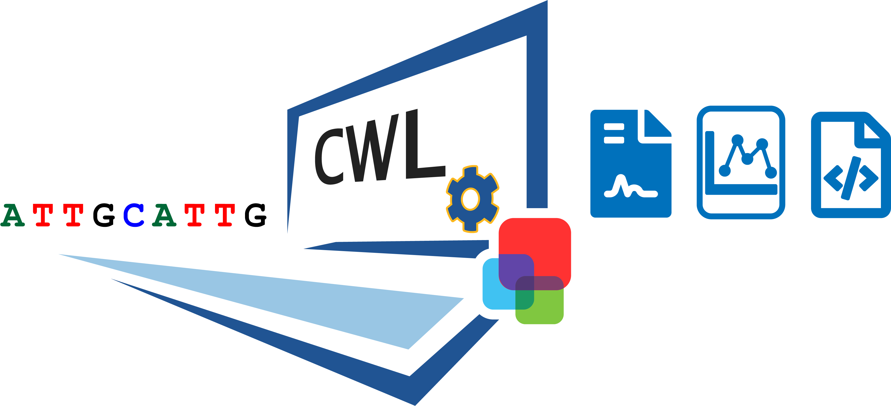

.. PM4NGS documentation master file, created by
   sphinx-quickstart on Wed Aug 19 10:46:48 2020.
   You can adapt this file completely to your liking, but it should at least
   contain the root `toctree` directive.

PM4NGS
======

.. image:: https://github.com/ncbi/pm4ngs/workflows/Python%20package/badge.svg
   :target: https://github.com/ncbi/pm4ngs/actions?query=workflow%3A%22Python+package%22

.. image:: https://github.com/ncbi/pm4ngs/workflows/Python%20application/badge.svg
   :target: https://github.com/ncbi/pm4ngs/actions?query=workflow%3A%22Python+application%22

.. image:: https://github.com/ncbi/pm4ngs/workflows/Upload%20Python%20Package/badge.svg
   :target: https://github.com/ncbi/pm4ngs/actions?query=workflow%3A%22Upload+Python+Package%22

.. toctree::
   :numbered:
   :maxdepth: 3
   :hidden:

   pipelines/installation
   pipelines/ubuntu
   pipelines/windowssl
   pipelines/pm4ngsgcp
   pipelines/sampleSheet
   pipelines/rnaseqDGAPipeline
   pipelines/chipseqPipeline
   pipelines/chipexoPipeline
   pipelines/transcriptomeAnnotationPipeline
   pipelines/creatingNewPipeline
   pipelines/utils
   pipelines/genomes

Introduction
------------

`PM4NGS`_ was designed to generate a standard organizational structure for Next Generation Sequencing
(NGS) data analysis. It includes a directory structure for the project, several Jupyter notebooks for data management
and CWL workflows for pipeline execution.

Our work was inspired by a manuscript by Prof. William Noble in 2009:
`A Quick Guide to Organizing Computational Biology Projects`_. We recommend reading this paper for a better
understanding of the guiding principles of our project.

The project is composed of three main parts.

#. A project organizational structure which define standard files and directories for the project
#. Jupyter Notebooks as user interfaces for data management and visualization
#. CWL workflows that execute the data analysis

**PM4NGS** source code includes the templates used by **cookiecutter** to generate the project
organizational structure and the Jupyter notebooks. The CWL workflows are defined in a separate GitHub project named:
`cwl-ngs-workflows-cbb`_.

.. _PM4NGS: https://github.com/ncbi/pm4ngs
.. _A Quick Guide to Organizing Computational Biology Projects: https://journals.plos.org/ploscompbiol/article?id=10.1371/journal.pcbi.1000424
.. _GNU Parallel: https://www.gnu.org/software/parallel/
.. _cwl-ngs-workflows-cbb: https://github.com/ncbi/cwl-ngs-workflows-cbb

Features
--------

* NGS data integration, management and analysis uses Jupyter notebooks, CWL workflows and cookiecutter project templates
* Easy installation and use with a minimum command line interaction
* Data analysis CWL workflows executed from the Jupyter notebook with automatic failing detection and can be validated with published data
* CWL workflows and Jupyter Notebooks are ready for cloud computing
* Project reports and dynamic content creation after data processing using CWL workflows are included
* Optional use of Docker/Biocontainers or Conda/Bioconda for Bioinformatics tool installations and managements are also included

Citation
-------------

#. Vera Alvarez R, Pongor LS, Mariño-Ramírez L and Landsman D. PM4NGS, a project management framework for next-generation sequencing data analysis, GigaScience, Volume 10, Issue 1, January 2021, giaa141, https://doi.org/10.1093/gigascience/giaa141
#. Vera Alvarez R, Mariño-Ramírez L and Landsman D. Transcriptome annotation in the cloud: complexity, best practices, and cost, GigaScience, Volume 10, Issue 2, February 2021, giaa163, https://doi.org/10.1093/gigascience/giaa163
#. Vera Alvarez R, Pongor LS, Mariño-Ramírez L and Landsman D. `Containerized open-source framework for NGS data analysis and management`_ [version 1; not peer reviewed]. F1000Research 2019, 8(ISCB Comm J):1229 (poster) (doi: 10.7490/f1000research.1117155.1)

.. _Containerized open-source framework for NGS data analysis and management: https://f1000research.com/posters/8-1229

Help and Support
----------------

For query/questions regarding PM4NGS, please write veraalva@ncbi.nlm.nih.gov

For feature requests or bug reports, please open an issue on `our GitHub Repository <https://github.com/ncbi/pm4ngs>`__.

Public Domain notice
--------------------

**National Center for Biotechnology Information.**

*This software is a "United States Government Work" under the terms of the United States
Copyright Act. It was written as part of the authors' official duties as United States
Government employees and thus cannot be copyrighted. This software is freely available
to the public for use. The National Library of Medicine and the U.S. Government have not
placed any restriction on its use or reproduction.*

*Although all reasonable efforts have been taken to ensure the accuracy and reliability
of the software and data, the NLM and the U.S. Government do not and cannot warrant the
performance or results that may be obtained by using this software or data. The NLM and
the U.S. Government disclaim all warranties, express or implied, including warranties
of performance, merchantability or fitness for any particular purpose.*

*Please cite NCBI in any work or product based on this material.*
